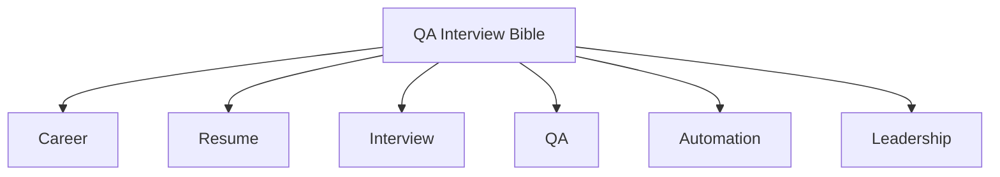

# Welcome

Welcome to the QA Interview Bible, a professional documentation website for building practical knowledge across software quality, testing craft, and career growth.

## Purpose of this Knowledge Base

This site is designed to centralize reusable notes, playbooks, and examples for QA professionals preparing for interviews, leading teams, and improving engineering quality.

!!! info "How to use this site"
    Start with the section most relevant to your current goal, then expand each area over time with notes, examples, and interview-ready stories.

## Roadmap

1. Build foundational content for QA, automation, API, and mobile testing.
2. Add structured interview answers, leadership case studies, and company research templates.
3. Expand real-world bug writeups, AI testing strategies, and reusable career assets.

## Latest Updates

- Initialized the documentation site with Material for MkDocs.
- Added section placeholders for core QA knowledge areas.
- Configured automatic GitHub Pages deployment with GitHub Actions.

## Site Map Preview

